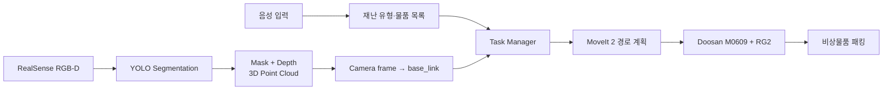

# P.A.C.K. — 재난 상황 비상물품 패킹 협동로봇

재난 유형을 음성으로 선택하면 필요한 비상물품을 RGB-D 비전으로 인식하고, Doosan M0609 협동로봇이 물품을 집어 패킹하는 ROS 2 시스템입니다.

▶ [1분 시연 영상](https://drive.google.com/file/d/1z7fK1n83B9fg4f2cSOuTmltv9qYJgL5V/view) · [원본 팀 저장소](https://github.com/Chan-Hyeok-Kim-git/cobot2-P.A.C.K.)

## 주요 기능

- 음성 명령으로 5개 재난 시나리오와 준비 물품 선택
- 11종 비상물품 instance segmentation
- RealSense D435I RGB와 aligned depth를 이용한 3D 대표점·PointCloud2 생성
- 카메라 좌표를 `base_link` 좌표로 변환
- MoveIt 2 기반 접근 경로 계획과 RG2 그리퍼 제어
- 물품별 접근·파지·이동·배치 작업

## 시스템 구조



최종 비전 경로는 segmentation 모델의 instance mask를 aligned depth에 직접 적용합니다. 데이터 라벨링은 기존 데이터로 Roboflow 자동 마스크 모델을 만든 뒤, 추가 이미지를 다시 처리하고 수동 검수하는 순환 방식으로 진행했습니다.

## 개발 환경

| 구분 | 구성 |
|---|---|
| OS / Middleware | Ubuntu 22.04, ROS 2 Humble |
| Robot | Doosan M0609, OnRobot RG2 |
| Vision | Intel RealSense D435I, Ultralytics YOLO Segmentation |
| Planning | MoveIt 2, OMPL |
| Language | Python, C++ |

## 저장소 구조

```text
├── cobot2_voice/              음성 입력과 재난 시나리오 선택
├── object_detector/           아래 AI 개발 브랜치 폴더 내부의 RGB-D segmentation
├── ai_frame_transform/        카메라 좌표 → base_link 변환
├── cobot2_interfaces/         파지 후보·계획·검증 메시지
├── cobot2_mi_cpp/             MoveIt 2 경로 계획
├── cobot2_control/            로봇 이동·파지·작업 관리
├── m0609_rg2_bringup/         M0609·RG2·카메라 모델과 bringup
└── m0609_rg2_moveit/          MoveIt 설정과 launch
```

AI 패키지는 `cobot2-P.A.C.K.-feature-ai-seg-pointcloud/src/object_detector`에 있습니다. 데이터 수집 및 모델 실험 방법은 해당 폴더의 [README](cobot2-P.A.C.K.-feature-ai-seg-pointcloud/README.md)를 참고하세요.

## 빌드

사전에 ROS 2 Humble, Doosan ROS 2, MoveIt 2, RealSense ROS, Ultralytics와 각 `package.xml`의 의존성을 설치해야 합니다. 학습 가중치는 저장소에 포함하지 않으므로 별도의 segmentation `best.pt` 경로가 필요합니다.

```bash
source /opt/ros/humble/setup.bash
cd ~/cobot_ws
colcon build --symlink-install
source install/setup.bash
```

## 실행 순서

장비 IP, 카메라 장착 TF와 모델 경로를 현장 설정에 맞게 확인한 뒤 각 터미널에서 실행합니다.

```bash
# 1. M0609 + RG2 + RealSense
ros2 launch m0609_rg2_bringup bringup_camera.launch.py

# 2. RGB-D instance segmentation
ros2 launch object_detector seg_pointcloud_with_camera.launch.py \
  model_path:=/absolute/path/to/segmentation_best.pt device:=0

# 3. 카메라 좌표를 로봇 기준 좌표로 변환
ros2 launch ai_frame_transform ai_frame_transform.launch.py

# 4. MoveIt 2와 작업 노드
ros2 launch cobot2_mi_cpp cobot2_mi.launch.py
ros2 run cobot2_control cobot2_grasp

# 5. 음성 명령
ros2 run cobot2_voice voice_command
```

TF 연결은 작업 전에 확인합니다.

```bash
ros2 run tf2_ros tf2_echo base_link camera_color_optical_frame
```

## 주요 인터페이스

| 토픽 | 내용 |
|---|---|
| `/ai/object_points` | 물체 mask 내부의 RGB-D PointCloud2 |
| `/ai/background_points` | 검출 물체를 제거한 배경 PointCloud2 |
| `/ai/objects_3d/json` | 클래스, 대표 픽셀, depth, camera/base 좌표 |
| `/ai/objects_3d/markers` | RViz2 확인용 중심점과 클래스 표시 |
| `/ai/detections_3d/image` | mask와 대표점이 표시된 영상 |

## 검증 결과

- 동일 테스트셋의 Mask mAP50-95: `0.8851 → 0.9220`
- 동일 89.831초 RGB-D bag의 AI worker 평균 처리시간: `88.98 ms → 39.22 ms`
- 실제 조건 36개 장면 중 33개에서 목표 클래스가 한 프레임 이상 검출
- 11종 물품별 접근·파지·이동·놓기 동작을 최소 1회 완료
- 최종 시연은 호루라기, 로프, 보호 마스크, 작업 장갑 4종으로 구성

`33/36`은 장면 단위 검출 여부이며 프레임 단위 정확도가 아닙니다. 처리시간도 AI worker 내부 측정값입니다.
